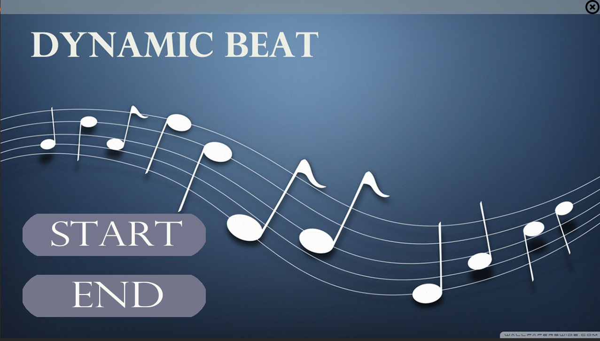
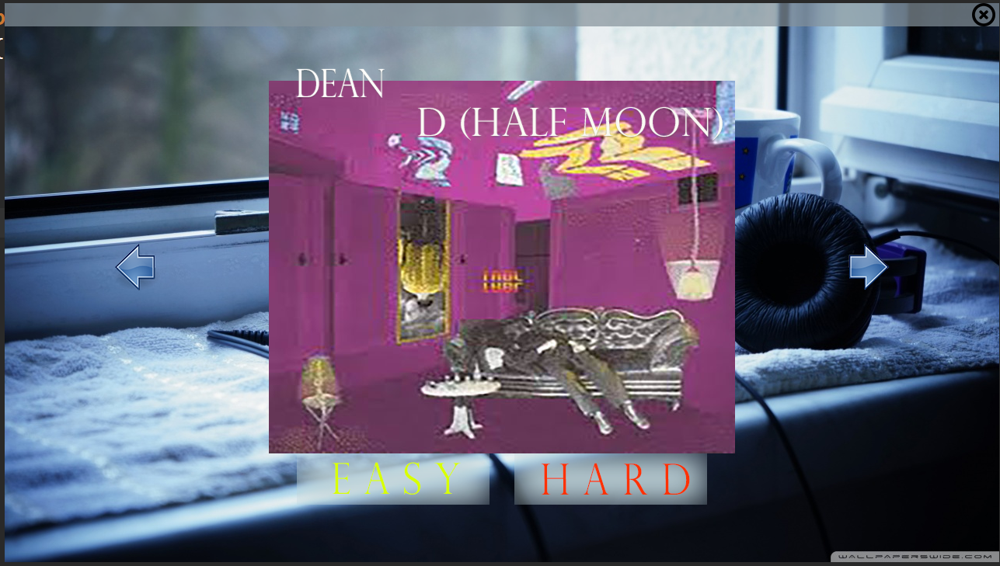

# RhythmGame

developed by Junhyuk Kim
***

Copyright [Junhyuk Kim]

https://github.com/okjcd123/RhythmGame  

Licensed under the Apache License, Version 2.0 (the "License");
you may not use this file except in compliance with the License.
You may obtain a copy of the License at

    http://www.apache.org/licenses/LICENSE-2.0

Unless required by applicable law or agreed to in writing, software
distributed under the License is distributed on an "AS IS" BASIS,
WITHOUT WARRANTIES OR CONDITIONS OF ANY KIND, either express or implied.
See the License for the specific language governing permissions and
limitations under the License.

***
# Intro Image

  
  

***

# Main Image

  
  

***
# Image Copyright
* Source code is opened to everybody, but some of the images copyright belongs to Junhyuk Kim!

 
All i wanna do main  
-https://www.google.co.kr/search?q=all+i+wanna+do&dcr=0&source=lnms&tbm=isch&sa=X&ved=0ahUKEwirsuSb7czYAhWMTbwKHd8-BmcQ_AUICygC&biw=1423&bih=695#imgrc=hE-d6SaPwS7_BM:
  
볼빨간 사춘기 - Fix me  
- https://www.google.co.kr/search?dcr=0&biw=1423&bih=695&tbm=isch&sa=1&ei=E75VWtakN8z_8gXIxaeICw&q=%EB%B3%BC%EB%B9%A8%EA%B0%84+%EC%82%AC%EC%B6%98%EA%B8%B0+fix+me&oq=%EB%B3%BC%EB%B9%A8%EA%B0%84+%EC%82%AC%EC%B6%98%EA%B8%B0+fix+me&gs_l=psy-ab.3..0i24k1l4.53816.59121.0.59262.32.22.2.8.8.0.130.1892.12j7.20.0....0...1c.1j4.64.psy-ab..3.28.1840.0..0j0i10i42k1j0i10k1j0i30k1.84.EoU8gJ2nsFs#imgrc=-erH1J8MjjUuBM:
  
Dean - D(Half Moon)  
- https://www.google.co.kr/search?dcr=0&biw=1423&bih=695&tbm=isch&sa=1&ei=UL5VWpjIC4n08QXR3qzICQ&q=%EB%94%98+d&oq=%EB%94%98+d&gs_l=psy-ab.3..0l10.66517.69518.0.69820.5.5.0.0.0.0.129.512.3j2.5.0....0...1c.1j4.64.psy-ab..2.3.311....0.ATuR3vgp7Ng#imgrc=yqmMcWAsosqFPM:
  

***
# Music Copyright
* Each music file contains only 30 sec sound, and these files are downloaded by Junhyuk Kim from Melon Music Player

***
